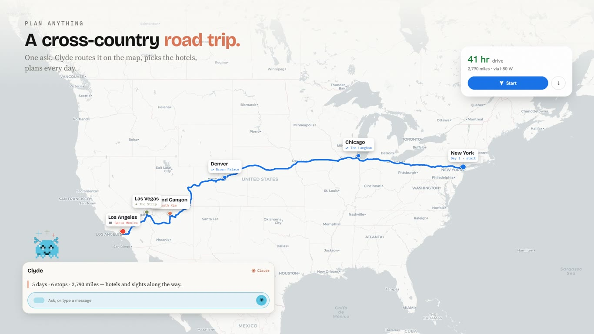
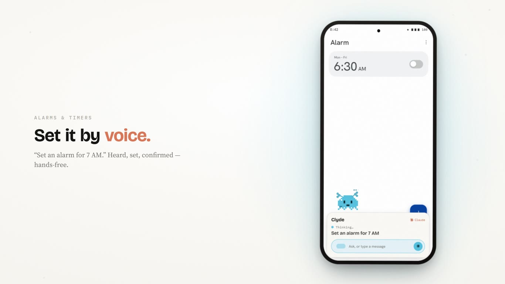
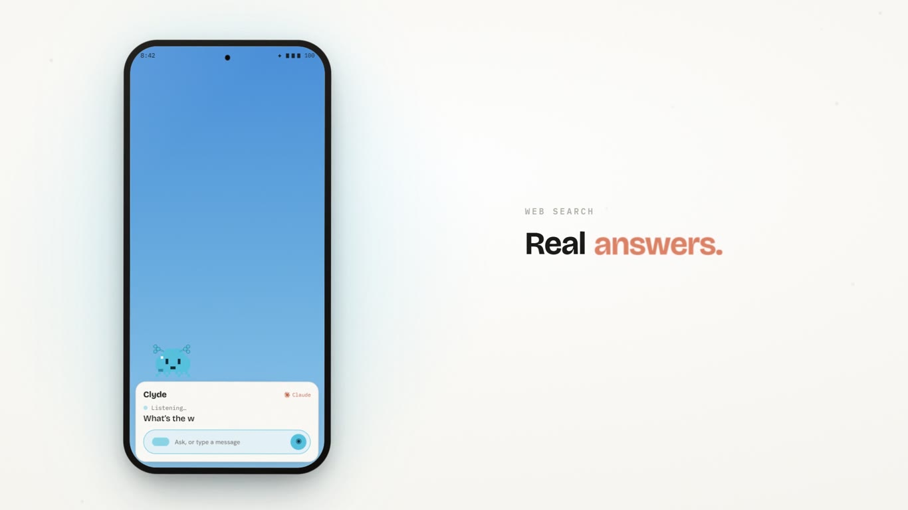
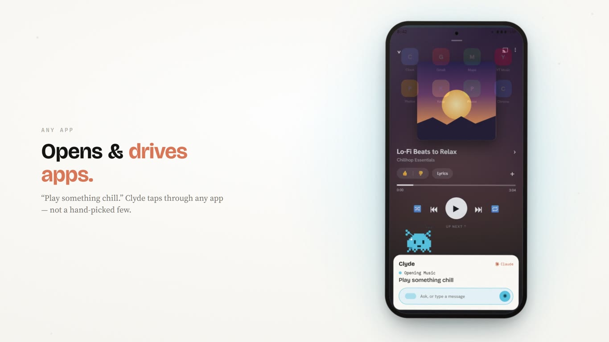
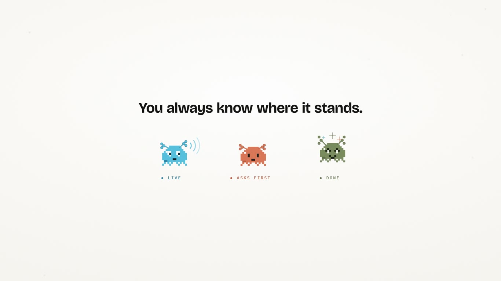

<div align="center">

# Clyde

### Claude, with hands.

**An Android assistant that replaces Gemini — powered by Claude on your own Pro/Max
subscription, running on your device.**

[](https://github.com/Archerkattri/clyde-android/releases/download/v0.1.50/clyde-promo-nicole.mp4)

**▶ [Watch the full video, with sound](https://github.com/Archerkattri/clyde-android/releases/download/v0.1.50/clyde-promo-nicole.mp4)**  ·  [Download the APK](https://github.com/Archerkattri/clyde-android/releases/latest)  ·  [Architecture](docs/architecture.md)

</div>

---

Clyde is a thin Android shell — trigger, voice, on-screen overlay, device control — wired to the real
**Claude Agent SDK** over loopback HTTP. There's no API billing: the brain signs in with `claude login`
on your subscription, and **refuses to start if `ANTHROPIC_API_KEY` is set** (an API key would silently
switch you to pay‑per‑token).

```
You ──assist gesture──▶ App shell ──127.0.0.1:8765──▶ Claude (Agent SDK · your subscription)
                           ▲                                   │
                           │                            calls phone-control tools
                           └────────── speaks / acts ◀─────────┘
```

## Why Clyde

The wedge isn't out-featuring Google or Apple — it's **reliability, honesty, generality, and privacy**:

- 🫡 **Won't make things up.** Clyde says what it knows and admits what it doesn't — no "here's what I found on the web."
- 🪜 **Shows its work.** It plans out loud, checks each step off as it goes, and **asks before anything irreversible**.
- 🧩 **Automates _any_ app** — through Android intents → accessibility → ADB → root, not a hand-picked whitelist.
- 🔒 **Runs on your device**, under your own Claude subscription. Nothing phones home.

## Positioning (2026)

The big labs are converging on phone automation, but from the opposite direction, and the lane they leave open is exactly Clyde's.

- **Google Gemini** now drives apps on-device, but through a **vendor whitelist** — a curated set of integrated apps, rolling out on Pixel and Galaxy hardware. If your app isn't on the list, Gemini can't touch it.
- **Anthropic's Orbit** (in testing) is the closest thing to Clyde: a Claude agent that operates the phone for you. When it ships it will overlap with what Clyde does, and with first-party polish. Worth saying plainly rather than pretending otherwise.

What Clyde does differently is **generality and ownership**:

- **Any app, no whitelist.** Clyde reaches every app through the ladder of Android intents → accessibility → ADB (Shizuku) → **root** (the T0–T3 tiers below), not a hand-picked integration list. On a rooted phone it can drive anything on the screen.
- **Root-tier control.** T3 (`su`) gives event injection, any permission, and persistence — a level a first-party assistant will not hand to a general agent.
- **Your subscription, your device.** Auth is your own Claude Pro/Max login (`claude login`); there's no per-token API billing, nothing phones home, and the brain refuses to start if `ANTHROPIC_API_KEY` is set.

The honest read: if Orbit ships and covers what you need, use it — it will be smoother on the mainstream path. Clyde is built for the **power-user / rooted tier** a whitelisted or first-party agent won't reach: full, local control of *any* app, under your own subscription, private by construction.

## See it

### Plan anything

[](docs/media/hero.jpg)

> *"Plan a 5-day road trip from New York to LA — hotels and must-sees."* Clyde maps the real route,
> drops pins for hotels, landmarks and sights, and builds the day-by-day itinerary.

### Everyday things, just by asking

| | |
|---|---|
|  |  |
| **Alarms, reminders, email, search** — hands-free. | **Honest answers**, straight to the point. |
|  |  |
| **Opens & drives any app** — "play something chill." | **You always know where it stands** (see the colour language below). |

### 🎙️ On-device neural voice  ·  *new in v0.1.49–50*

Choose the assistant's voice — **Bella** (default), **Nicole**, **Adam**, **Santa**, or **Lewis** —
synthesized **entirely on-device** with [Kokoro-82M](https://huggingface.co/hexgrad/Kokoro-82M) via
[sherpa-onnx](https://github.com/k2-fsa/sherpa-onnx). Switch it in Settings and it applies live,
mid-conversation. (Those same voices narrate the demo above — the highlight reel uses Nicole.)

## Install

Grab the signed APK from [**Releases**](https://github.com/Archerkattri/clyde-android/releases/latest)
and sideload it on an **arm64** Android phone (Android 12+).

1. Open Clyde → **sign in** with your Claude Pro/Max subscription (`claude login`, one time).
2. Grant the **overlay** + **accessibility** permissions the setup wizard requests.
3. Trigger it with your phone's **assist gesture** — and talk, or type.

> **The one rule:** never set `ANTHROPIC_API_KEY`. Clyde runs on your subscription; an API key flips it
> to per-token billing, so the brain **fails loud** if one is present.

Two runtime flavours: the **embedded build** runs the brain in-process (no Termux), and a **companion
build** talks to the brain in [Termux](termux/) as a fallback (`termux/setup.sh`).

## The four control tiers

Clyde calls `capabilities()` and picks the lowest-friction correct tool for each action:

- **T0** — Android intents + Termux:API (alarms, calls, SMS, navigation, sensors). No special perms.
- **T1** — Accessibility (read the screen, tap/type/swipe, screenshots). No root.
- **T2** — Shizuku / `rish` (ADB-level: input, `pm`, settings, `uiautomator`). No root.
- **T3** — Root / `su` (event injection, any permission, persistence).

Consequential actions (texts, calls, purchases, system changes) require an in-app confirmation that
returns a **single-use token bound to the exact action and arguments**. Money movement is a hard stop.

## Design — “Warm Paper, Live Blue”

A deliberately flat, anti-slop identity. Warm paper canvas `#FAF9F5`; **Blizzard Blue `#56C1DE`** is
"live" only (mic, focus, the one primary CTA — *blue is a verb*); **Claude Terracotta `#D97757`** is the
"powered by Claude" signature; Anthropic green `#788C5D` means done. Type is Bricolage Grotesque /
Hanken Grotesk / Source Serif (Claude's "answer voice") / IBM Plex Mono.

**Shiny Clawd** — our own **license-clean** 8-bit pixel crab, drawn natively in Compose (no image/GIF assets;
grid source in `design/assets/clawd/gen-sprite.mjs`). He's fully rigged — squash & stretch, articulated
claws, expressions — and recolours blue → terracotta → green to mirror live / asking / done.

## Build from source

- **App:** `gradlew :app:assembleRelease` (JDK 21). Signing is read from `app/keystore.properties`
  (gitignored — supply your own keystore). The on-device voice needs the sherpa-onnx AAR:
  `bash scripts/fetch-sherpa-aar.sh`.
- **Brain:** `cd brain && npm install && npm run typecheck && npm test`.
- **Embedded runtime asset:** `bash bootstrap/build.sh` on Linux/Docker (multi-hour; arm64 only).

## Layout

- `app/` — Kotlin + Jetpack Compose shell (+ the embedded-runtime extractor/runner, on-device TTS).
- `brain/` — TypeScript Claude Agent SDK server + the phone-control tools.
- `bootstrap/` — builds the embedded Node runtime asset (`bootstrap/README.md`).
- `design/` — design tokens + our own Shiny Clawd sprite source.
- `docs/` — architecture, tool catalog, permissions, build phases.
- `termux/`, `scripts/` — companion setup + build helpers.

## Security

The loopback secret is **AES-256/GCM-encrypted under a TEE Android-Keystore key**. Consequential tools
require a single-use, args-bound confirmation token. URLs are shown in full before any link is opened.
See `docs/` and `NOTICE.md` for third-party binary licenses.

## Credits

Powered by **Claude** (Anthropic). On-device speech: **Kokoro-82M** + **sherpa-onnx** (Apache-2.0). The
demo map uses **© OpenStreetMap** data. Shiny Clawd is our own original art. Not affiliated with Google.
